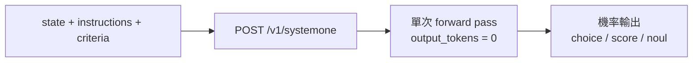
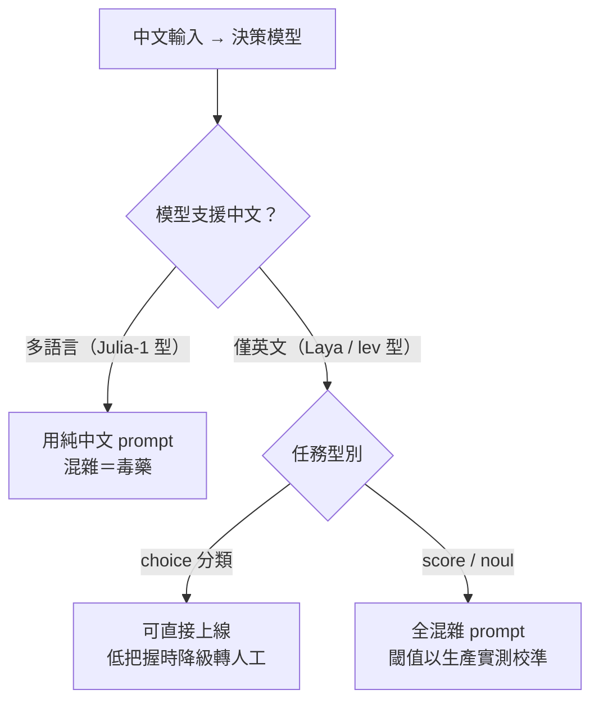
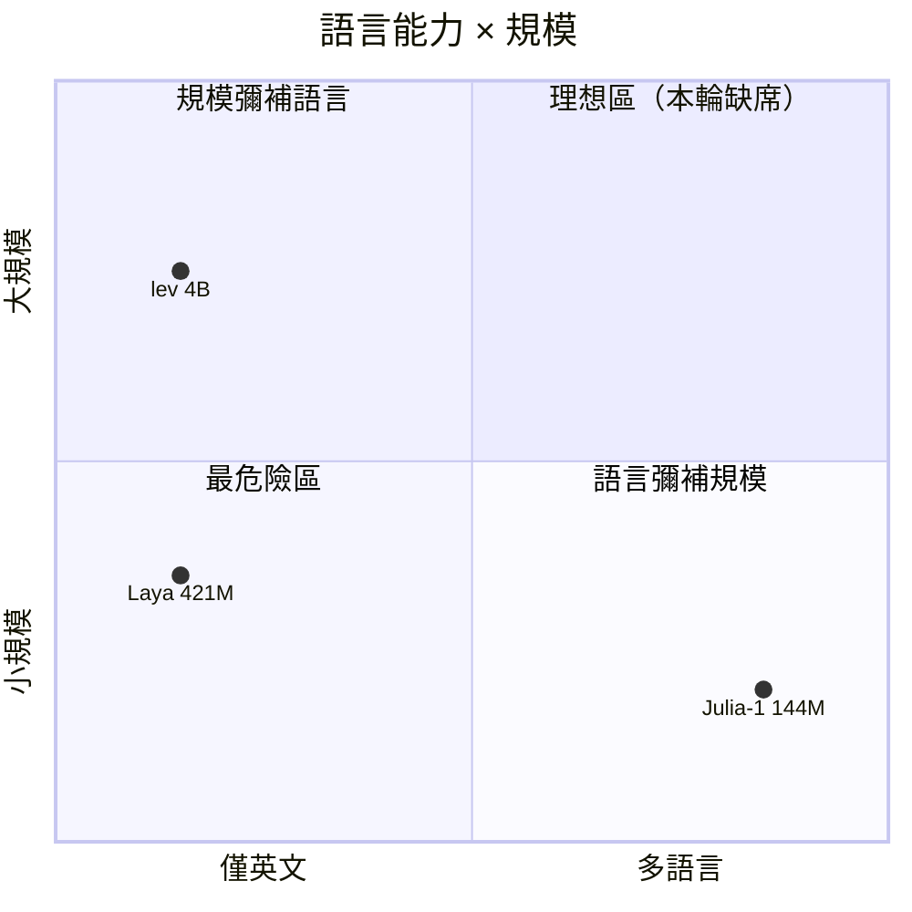
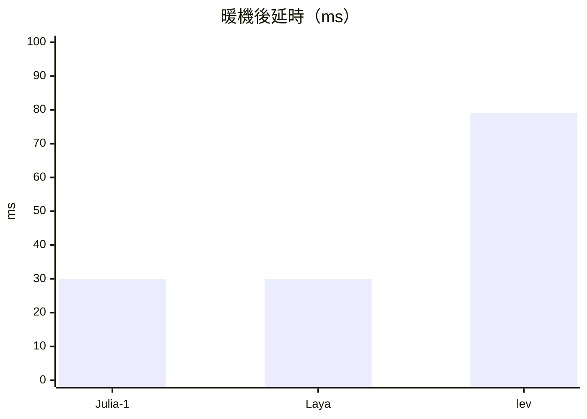

# SystemOne 決策模型能力測試報告

| | |
|---|---|
| 版本 | v3.0（易讀化重寫版；逐項數值全部下沉附錄） |
| 測試日期 | 2026-10-03 |
| 對象 | Julia-1-Q8_0（144M，50+ 語言）、Laya-Q8_0（421M，僅英文）、lev-Q4_K_M（4B，僅英文） |
| 資料集 | 3 模型 × 3 場景 × 3 語言 ＝ 27 筆請求，全數 HTTP 200 |
| 端點規格與判定門檻 | 見本地 [`systemone_api.md`](systemone_api.md)；判定門檻定義收錄於附錄 A |
| 資料參考來源 | 見附錄 E |

**閱讀指引**：只有 5 分鐘 → 讀 §2 結論 ＋ §4 總表。要看數值 → 附錄 B／C。想知道資料怎麼來的 → 附錄 D／E。

---

## §0 這是什麼、為什麼值得讀

想像客服系統收到一張工單：「我上週的訂單被扣了兩次款，沒有人回覆。」

傳統做法是把這段文字丟給聊天模型，請它回一段 JSON，再解析。慢、貴、還會解析失敗。

決策模型不寫文章。它把工單文字與你給的選項一起讀過**一次**，直接吐出每個選項的機率——不生成任何文字，所以應答裡永遠沒有「生成中」。

本報告回答一個很實際的問題：**中文工單丟給這三個模型，誰能用、怎麼用、哪裡會翻車。**

為什麼值得讀：這三個模型一個多語言、兩個僅英文，尺寸差 28 倍。測試顯示「怎麼寫 prompt」的影響會因模型而**反向**——同一招救活一個模型、毒死另一個。選錯組合，你的 AI 客服會在中文面前裝死。

---

## §1 名詞速查

本報告只用這八個詞。先讀本表，後面不再解釋。

| 詞 | 白話解釋 | 本報告中的真實範例 |
|---|---|---|
| state | 要被判斷的輸入原文 | 工單內容：「我上週的訂單被扣了兩次款」 |
| instructions ＋ criteria | 你問的問題 ＋ 每個選項的定義 | 問「這該給哪個團隊？」；billing＝金流、shipping＝配送 |
| choice | 選擇題。回傳選中的選項與每個選項的機率（機率總和＝1） | 路由：billing／shipping／technical 三選一 |
| score | 等級題（由低到高 2～10 級）。回傳期望值，可以落在兩級之間 | 緊急度：可以等／本週／今天／立刻 → 回傳 1.9 之類 |
| noul | 是非題。回傳「是」的機率 | 「客戶生氣了嗎？」→ 0.85 就是 85% 是 |
| confidence | 模型自報的把握度（0～1）。把握越低越該轉人工 | 同一張中文工單，Laya 的把握明顯比英文低 |
| Δ（三角） | 同一題用英／中／混雜三個版本去問，三個答案問出的最大差距。Δ 越大＝越受語言影響 | 三語答案幾乎一樣 → Δ 小；差一倍 → Δ 大 |
| 暖機 | 模型載入後的第一筆請求特別慢，之後才穩定。第一筆的延時不具參考價值 | 暖機後延時只有暖機前的零頭 |

---

## §2 結論

**一句話：模型的語言能力決定一切，prompt 措辭只是配角——而且同一句 prompt 對不同模型的效果會反向。**

三條可直接執行的動作：

1. **多語言模型（Julia-1 型）：純中文 prompt。** 混雜 prompt 讓它的 severity 幾乎砍半、緊急度從最高掉到最低——混雜對它是毒藥。
2. **僅英文模型（Laya／lev 型）：中文骨架 ＋ 英文關鍵字的混雜 prompt。** 對 Laya 能把 confidence 拉回接近英文水準；對 lev 能把緊急度與分類明顯抬升。
3. **confidence 閾值逐模型校準，並把「低把握 → 轉人工」寫進流程。** confidence 是語言能力的指紋：僅英文模型遇到中文，把握會集體掉到明顯偏低的水準——這個訊號本身就有用。

---

## §3 三個模型的個性

**Julia-1（144M・50+ 語言）**——中文是它的母語。中文工單的判斷穩到機率常接近滿分，三語判定全部一致。但它有兩個脾氣：中文分數**系統性偏高**（緊急度、嚴重度都是），而混雜 prompt 對它是毒藥，severity 項幾乎砍半、模型還自報完全沒把握。
適合：中文為主的小規模分類。不適合：未校準的中文數值打分。

**Laya（421M・僅英文）**——中文對它是硬撐，而且它很誠實：中文時把握度明顯掉到偏低區間，這是語言能力指紋，不是 bug。判斷（選擇題）撐得住，分數全線偏低。好消息：混雜 prompt 能把把握與 severity 拉回接近英文水準。它的中文 token 造價也是三者最高。
適合：英文為主、中文輸入走混雜 prompt 的流程。不適合：純中文數值打分。

**lev（4B・僅英文）**——本場最沉穩：七項裡五項跨語言穩定，severity 是唯一三語「相近」的數值項。但它最貴（token 造價與延時都是三者最高），且 angry、urgency 兩項仍跨語言分歧。它是唯一在 CPU 暖機後仍穩在 200 ms SLA 內線內的。
適合：要數值打分穩定、要延時 SLA 的場景。不適合：中文為主的小規模場景。

> 選型不是挑最聰明的，是挑語言對的那個。

---

## §4 一覽總表

27 筆請求、七個測試項、三個模型。判定符號定義見附錄 A，逐項數值見附錄 B。

| 測試項 | Julia-1 | Laya | lev |
|---|---|---|---|
| ① 工單路由（choice） | ✅ 一致 | ✅ 一致 | ✅ 一致 |
| ① 客戶怒氣（noul） | ⚠ 偏移 | ⚠ 偏移 | 🔴 分歧 |
| ① 緊急度（score） | 🔴 分歧 | 🔴 分歧 | 🔴 分歧 |
| ② 內容分類（choice） | ✅ 一致 | ✅ 一致 | ✅ 一致 |
| ② 嚴重度（score） | 🔴 分歧 | 🔴 分歧 | ✅ 相近 |
| ③ 任務成功與否（noul） | 🔴 分歧 | ⚠ 偏移 | ✅ 相近 |
| ③ 需人工介入（noul） | ⚠ 偏移 | ⚠ 偏移 | ✅ 相近 |

**讀法：選擇題全場過關；是非題是重災區；數值題只有 lev 的嚴重度撐住了跨語言。**

---

## §5 選型速查

| 你的需求 | 建議 | 依據 |
|---|---|---|
| 中文為主的分類／路由 | Julia-1，純中文 prompt | 附錄 B（Julia 中文欄）、附錄 C 三因子表 |
| 英文流程、偶有中文輸入 | Laya，混雜 prompt ＋ 低把握轉人工 | 附錄 B（Laya 混雜欄回穩） |
| 要緊急度／嚴重度打分穩定 | lev，混雜 prompt ＋ 生產校準閾值 | 附錄 B（lev ②severity 相近）、附錄 C |
| CPU 部署、延時 SLA 嚴苛 | lev（暖機後仍在線內）或 Laya | 附錄 C 延時細節 |
| 預算敏感、量大 | Julia-1（中文 token 增幅最小） | 附錄 C token 成本表 |

---

## §6 風險

1. **noul 極值區不可信**：機率掉到極低區（<0.15）時，讀方向就好，別讀數值。Julia 的「任務成功」在三語間從極低跳到極高，就是踩中這個區。
2. **冷啟動延時陷阱**：第一筆請求是暖機（實測可達數十秒）。**冷啟動數據寫進 SLA，就是自欺。**
3. **confidence 沒有通用閾值**：僅英文模型的中文把握天然偏低，拿英文場景校的閾值直接套中文，會把大量正解判成低把握。逐模型、逐語言校。
4. **樣本規模**：每項僅一題 × 三語。本報告給的是**方向**，不是統計結論；上線前請用你自己的工單重跑附錄 D 的方法。

---

## §7 動手試試看

1. 啟動服務：`llama serve --model <你的 gguf>`（端點預設 `http://localhost:8080/v1/systemone`）。
2. 用瀏覽器開啟根目錄的 `index.html`（啟動頁，自動進入 `spa/index.html`），測試台會自動偵測端點與模型語言能力標牌。
3. 把入門範例的字改成中文，跑一次，看 choice 機率條（總和＝1）與 score 期望值。
4. 開啟 `compare.html`，選模型、執行三語比對（串行 en→zh→mix），看 Δ 判定。
5. 第一個實驗建議：同一張**中文** state，對**僅英文模型**分別用純中文與混雜 prompt 各跑一次，盯著 confidence 的差距看——你會親眼看到 §2 那張分流圖的由來。

比對紀錄存在瀏覽器 localStorage（`s1.compareHistory`），重開頁面不丟失。

---
---

# 附錄

## 附錄 A 判定門檻定義

| 項目類型 | 判定 | 定義 |
|---|---|---|
| choice（選擇題） | ✅ 一致 | 英／中／混雜三語選中同一選項 |
| choice（選擇題） | ⚠ 部分分歧 | 三語中僅 2/3 選中同一選項 |
| score／noul（數值） | ✅ 相近 | Δ ≤ 0.15 |
| score／noul（數值） | ⚠ 偏移 | 0.15 < Δ ≤ 0.35 |
| score／noul（數值） | 🔴 分歧 | Δ > 0.35 |

- **Δ 定義**：同一題以英／中／混雜三版提問，三個有效答案中的最大差距。
- 有效值不足 2 筆 → 記為「資料不足」。
- noul 值 < 0.15 視為極值區：僅供方向參考，不參與數值判讀。
- 本門檻為本測試自訂的解讀規則（非官方規格），規格化定義同步收錄於本地 `systemone_api.md` §8.1。

## 附錄 B 逐模型完整數值

> 以下九張表為全部原始數值。每張表標註模型、取得日期、請求數與端點。延時欄首列含暖機（見附錄 C）。

### B-1 Julia-1-Q8_0（144M・50+ 語言）

取得日期 2026-10-03 ｜ 9 筆請求全 HTTP 200 ｜ 端點 `http://localhost:8080/v1/systemone` ｜ vocab 256,000 ｜ n_params 144,192,769

**① 客服工單路由**

| 測試項 | 語言 | 結果 | 機率 | confidence | 延時 (ms) |
|---|---|---|---|---|---|
| route（choice） | en | billing | 0.988 | 0.982 | 349（含暖機） |
| route（choice） | zh | billing | 1.000 | 1.000 | 30 |
| route（choice） | mix | billing | 0.996 | 0.994 | 18 |
| angry（noul） | en | — | 0.851 | — | |
| angry（noul） | zh | — | 0.668 | — | |
| angry（noul） | mix | — | 0.706 | — | 判定 ⚠ 偏移 Δ0.183 |
| urgency（score） | en | 1.152 | — | 0.847 | |
| urgency（score） | zh | 1.958 | — | 0.827 | |
| urgency（score） | mix | 1.552 | — | 0.433 | 判定 🔴 分歧 Δ0.806 |

tokens：en 128 ／ zh 177 ／ mix 170

**② 內容審核**

| 測試項 | 語言 | 結果 | 機率 | confidence | 延時 (ms) |
|---|---|---|---|---|---|
| category（choice） | en | complaint | 0.892 | 0.865 | 315（含暖機） |
| category（choice） | zh | complaint | 1.000 | 1.000 | 22 |
| category（choice） | mix | complaint | 1.000 | 1.000 | 21 |
| severity（score） | en | 1.564 | — | 0 | |
| severity（score） | zh | 2.005 | — | 0.845 | |
| severity（score） | mix | 1.033 | — | 0 | 判定 🔴 分歧 Δ0.972 |

tokens：en 104 ／ zh 130 ／ mix 124

**③ Agent 自評**

| 測試項 | 語言 | 結果 | 機率 | confidence | 延時 (ms) |
|---|---|---|---|---|---|
| succeeded（noul） | en | — | 0.146 | — | 319（含暖機） |
| succeeded（noul） | zh | — | 0.760 | — | 12 |
| succeeded（noul） | mix | — | 0.880 | — | 12 |
| needs_human（noul） | en | — | 0.002 | — | |
| needs_human（noul） | zh | — | 0.012 | — | |
| needs_human（noul） | mix | — | 0.160 | — | 判定 ⚠ 偏移 Δ0.158 |

succeeded 判定 🔴 分歧 Δ0.734 ｜ tokens：en 88 ／ zh 99 ／ mix 101

### B-2 Laya-Q8_0（421M・僅英文）

取得日期 2026-10-03 ｜ 9 筆請求全 HTTP 200 ｜ 端點 `http://localhost:8080/v1/systemone` ｜ vocab 50,368 ｜ n_params 421,029,889

**① 客服工單路由**

| 測試項 | 語言 | 結果 | 機率 | confidence | 延時 (ms) |
|---|---|---|---|---|---|
| route（choice） | en | billing | 0.984 | 0.975 | 30 |
| route（choice） | zh | billing | 0.793 | 0.689 | 29 |
| route（choice） | mix | billing | 0.949 | 0.924 | 25 |
| angry（noul） | en | — | 0.790 | — | |
| angry（noul） | zh | — | 0.502 | — | |
| angry（noul） | mix | — | 0.806 | — | 判定 ⚠ 偏移 Δ0.304 |
| urgency（score） | en | 1.931 | — | 0 | |
| urgency（score） | zh | 0.967 | — | 0.854 | |
| urgency（score） | mix | 2.171 | — | 0.171 | 判定 🔴 分歧 Δ1.205 |

tokens：en 163 ／ zh 349 ／ mix 292

**② 內容審核**

| 測試項 | 語言 | 結果 | 機率 | confidence | 延時 (ms) |
|---|---|---|---|---|---|
| category（choice） | en | complaint | 0.820 | 0.775 | 321（含暖機） |
| category（choice） | zh | complaint | 0.563 | 0.454 | 20 |
| category（choice） | mix | complaint | 0.715 | 0.643 | 17 |
| severity（score） | en | 2.263 | — | 0.604 | |
| severity（score） | zh | 1.623 | — | 0.260 | |
| severity（score） | mix | 2.105 | — | 0.775 | 判定 🔴 分歧 Δ0.641 |

tokens：en 126 ／ zh 281 ／ mix 223

**③ Agent 自評**

| 測試項 | 語言 | 結果 | 機率 | confidence | 延時 (ms) |
|---|---|---|---|---|---|
| succeeded（noul） | en | — | 0.747 | — | 15 |
| succeeded（noul） | zh | — | 0.872 | — | 16 |
| succeeded（noul） | mix | — | 0.715 | — | 17 |
| needs_human（noul） | en | — | 0.092 | — | |
| needs_human（noul） | zh | — | 0.352 | — | |
| needs_human（noul） | mix | — | 0.079 | — | 判定 ⚠ 偏移 Δ0.273 |

succeeded 判定 ⚠ 偏移 Δ0.157 ｜ tokens：en 116 ／ zh 183 ／ mix 170

### B-3 lev-Q4_K_M（4B・僅英文）

取得日期 2026-10-03 ｜ 9 筆請求全 HTTP 200 ｜ 端點 `http://localhost:8080/v1/systemone` ｜ vocab 248,320 ｜ n_params 4,205,751,296

**① 客服工單路由**

| 測試項 | 語言 | 結果 | 機率 | confidence | 延時 (ms) |
|---|---|---|---|---|---|
| route（choice） | en | billing | 0.915 | 0.873 | 391（含暖機） |
| route（choice） | zh | billing | 0.969 | 0.953 | 74 |
| route（choice） | mix | billing | 0.968 | 0.952 | 78 |
| angry（noul） | en | — | 0.492 | — | |
| angry（noul） | zh | — | 0.713 | — | |
| angry（noul） | mix | — | 0.890 | — | 判定 🔴 分歧 Δ0.398 |
| urgency（score） | en | 1.562 | — | 0.235 | |
| urgency（score） | zh | 1.664 | — | 0.183 | |
| urgency（score） | mix | 2.311 | — | 0.311 | 判定 🔴 分歧 Δ0.749 |

tokens：en 536 ／ zh 582 ／ mix 606

**② 內容審核**

| 測試項 | 語言 | 結果 | 機率 | confidence | 延時 (ms) |
|---|---|---|---|---|---|
| category（choice） | en | complaint | 0.743 | 0.679 | 58 |
| category（choice） | zh | complaint | 0.612 | 0.515 | 59 |
| category（choice） | mix | complaint | 0.537 | 0.421 | 60 |
| severity（score） | en | 2.251 | — | 0.251 | |
| severity（score） | zh | 2.285 | — | 0.285 | |
| severity（score） | mix | 2.394 | — | 0.394 | 判定 ✅ 相近 Δ0.143 |

tokens：en 457 ／ zh 484 ／ mix 490

**③ Agent 自評**

| 測試項 | 語言 | 結果 | 機率 | confidence | 延時 (ms) |
|---|---|---|---|---|---|
| succeeded（noul） | en | — | 0.938 | — | 37 |
| succeeded（noul） | zh | — | 0.876 | — | 37 |
| succeeded（noul） | mix | — | 0.931 | — | 37 |
| needs_human（noul） | en | — | 0.076 | — | |
| needs_human（noul） | zh | — | 0.059 | — | |
| needs_human（noul） | mix | — | 0.116 | — | 判定 ✅ 相近 Δ0.057 |

succeeded 判定 ✅ 相近 Δ0.062 ｜ tokens：en 240 ／ zh 246 ／ mix 252

## 附錄 C 橫向分析

### C-1 三因子總表

| 因子 | Julia-1 | Laya | lev |
|---|---|---|---|
| 一致＋相近項數（共 7 項） | 2／7 | 2／7 | 5／7 |
| 中文欄 choice confidence 區間 | 0.865～1.000 | 0.454～0.689 | 0.515～0.953 |
| 中文欄 score 方向 | 偏高（+0.4～+0.8） | 偏低（−0.6～−1.0） | ≈中性（Δ0.14～0.75） |
| 中文 token 造價／英文 | 1.13～1.38× | 1.58～2.23× | 1.09～1.13× |
| 暖機後延時 | 12～30 ms | 15～30 ms | 37～79 ms |

### C-2 模型定位象限圖

### C-3 暖機後延時

### C-4 Token 成本

- 中文相對英文：Laya 1.58～2.23×（三者最高）、Julia-1 1.13～1.38×、lev 1.09～1.13×。
- 混雜 prompt 落在英／中之間：Laya mix／en 為 1.47～1.79×。
- 解讀：僅英文模型處理中文的 token 膨脹最兇——中文對它是「外語翻譯費」。

### C-5 延時細節

- 暖機後（每模型第 2 筆起）：Julia-1 12～30 ms、Laya 15～30 ms、lev 37～79 ms。
- 每模型首筆（含載入暖機）：315～391 ms；另觀測到一筆 34.7 s 的極端離群值（首次載入）。
- lev（4B）在純 CPU 下暖機後仍穩定低於 200 ms SLA；Julia-1 與 Laya 餘量更大。
- 結論重申：SLA 只可用暖機後數據。

## 附錄 D 方法與資料完整性

### D-1 端點行為

- `POST http://localhost:8080/v1/systemone`：單次 forward pass，`output_tokens` 恆為 0，直接回傳機率（choice 機率總和＝1、score 期望值、noul 機率）。
- 探測：`GET /health`、`GET /v1/models`（單模型模式下請求的 `model` 欄位被忽略）。
- 決定性：同一 prompt 重複請求輸出完全相同。

### D-2 三語測試設計

每題以三個版本提問：en（全英文）、zh（全中文）、mix（中文骨架＋英文關鍵字）。七個測試項＝①route／angry／urgency、②category／severity、③succeeded／needs_human。

### D-3 舊設計基線（僅 state 混雜的早期設計）

| 模型 | route | angry | urgency | category | severity | succeeded | needs_human |
|---|---|---|---|---|---|---|---|
| lev | 0.960 | 0.882 | 2.125 | 0.396 | 2.317 | 0.937 | 0.156 |
| Julia-1 | 0.989 | 0.827 | 1.040 | — | 1.718 | 0.007 | 0.002 |
| Laya | 0.903 | 0.755 | 2.021 | 0.864 | 2.340 | 0.832 | 0.067 |

choice 判定與新設計不變，數值偏移 ≤0.19（lev）／≤0.235（Laya）。

### D-4 可重現性證明

Laya 的 en／zh 兩欄與早期測試數值逐位相同（route 0.984／0.793、severity 2.263／1.623、succeeded 0.747／0.872）——單次 forward pass 的決定性直接由資料本身驗證。

### D-5 測試台 QA（index.html／compare.html）

端點探測與語言能力標牌（Julia「50+ 語言」／Laya・lev「僅英文⚠」）、單請求視覺化（choice 機率條總和＝1、score 期望、noul 環形）、messages 模式（topic→delivery 0.9998）、27 請求全 200、頁面拆分與歷史分離（`s1.history`／`s1.compareHistory`）、離線 ERR 處理、localStorage 還原、預設範例——全程無 JS 例外。

## 附錄 E 資料參考來源

**外部來源**
- llama.cpp PR #29818「server: add /v1/systemone API」（ngxson, ggml-org/llama.cpp）：https://github.com/ggml-org/llama.cpp/pull/29818
- Hugging Face 官方部落格「New in llama.cpp: Decision Models」（ggml-org，2026-10-02 發布）：https://huggingface.co/blog/ggml-org/decision-models-in-llamacpp
- llama.cpp server 端點文件：https://github.com/ggml-org/llama.cpp/blob/master/tools/server/README.md
- 模型卡：Julia-1（https://huggingface.co/ggml-org/Julia-1-GGUF）、Laya（https://huggingface.co/ggml-org/Laya-GGUF）、lev（https://huggingface.co/ggml-org/lev-GGUF）；決策模型合集：https://huggingface.co/collections/ggml-org/decision-models

**本地來源**
- [`systemone_api.md`](systemone_api.md)：端點規格與 §8.1 判定門檻
- [`common.js`](common.js)：三語範例設計
- [`spa/index.html`](../spa/index.html)／[`spa/compare.html`](../spa/compare.html)／[`spa/compare.js`](../spa/compare.js)：測試台與比對台（根目錄 `index.html` 為啟動跳轉頁）

**原始資料**
- 端點：`http://localhost:8080/v1/systemone`（llama.cpp server，單模型模式，依序載入 Julia-1 → Laya → lev）
- 取得日期：2026-10-03；27 筆請求全數 HTTP 200
- 執行紀錄：compare.html 瀏覽器 localStorage（`s1.compareHistory`）
- 附錄 D-3 舊設計基線：同端點早期測試紀錄
